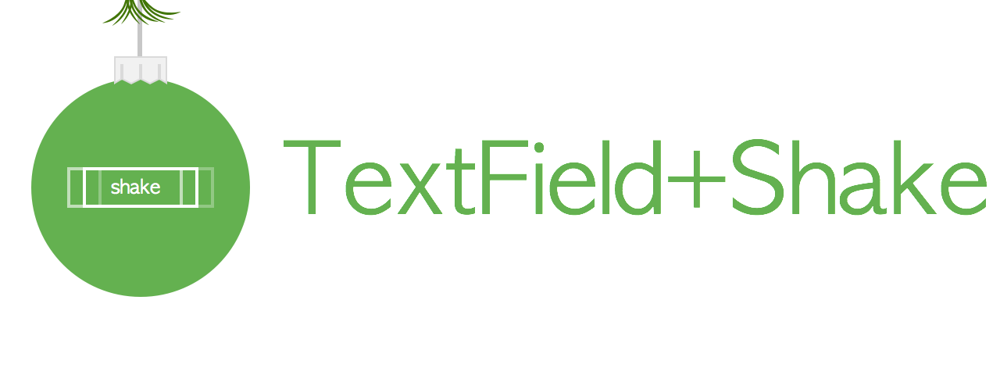

<p align="center">
  
</p>

[](https://travis-ci.org/andreamazz/UITextField-Shake)
[](http://cocoapods.org/?q=summary%3Auitextfield%20name%3Ashake%2A)
[](http://cocoapods.org/?q=summary%3Auitextfield%20name%3Ashake%2A)
[](https://coveralls.io/r/andreamazz/UITextField-Shake)
[](https://github.com/Carthage/Carthage)

UITextField category that adds a shake animation like the password field of the OsX login screen.

<a target='_blank' rel='nofollow' href='https://app.codesponsor.io/link/9Jjp1jzKpTgCg7fq5tVzNmnV/andreamazz/UITextField-Shake'>
  
</a>

<p align="center">
  <a href='https://appetize.io/app/20h2nwzbz128ebvwgf0kkm3tmg' alt='Live demo'>
    
  </a>
</p>

## Screenshot


## Setup with CocoaPods
```
pod 'UITextField+Shake', '~> 1.2'
```
Import ```UITextField+Shake.h``` in your controller's header file, or ```UITextField_Shake``` if you are using the `use_frameworks!` directive.

## Setup with Carthage
```
github "andreamazz/UITextField-Shake"
```

## Usage

### In Objective-C

```objc
// Shake
[[self.textField] shake];

// Shake with the default speed
[self.textField shake:10   // 10 times
            withDelta:5    // 5 points wide
];

// Shake with a custom speed
[self.textField shake:10   // 10 times
            withDelta:5    // 5 points wide
                speed:0.03 // 30ms per shake
];

// Shake with a custom speed and direction
[self.textField shake:10   // 10 times
            withDelta:5    // 5 points wide
                speed:0.03 // 30ms per shake
       shakeDirection:ShakeDirectionVertical
];
```

### In Swift

```swift
// Shake
self.textField.shake()

// Shake with the default speed
self.textField.shake(10,              // 10 times
                     withDelta: 5.0   // 5 points wide
)

// Shake with a custom speed
self.textField.shake(10,              // 10 times
                     withDelta: 5.0,  // 5 points wide
                     speed: 0.03      // 30ms per shake
)

// Shake with a custom speed and direction
self.textField.shake(10,              // 10 times
                     withDelta: 5.0,  // 5 points wide
                     speed: 0.03,     // 30ms per shake
                     shakeDirection: ShakeDirection.Vertical
)
```

## Completion Handler
You can also pass a completion block that will be performed as soon as the shake animation stops
```objc
- (void)shake:(int)times withDelta:(CGFloat)delta completion:(void((^)()))handler;
- (void)shake:(int)times withDelta:(CGFloat)delta speed:(NSTimeInterval)interval completion:(void((^)()))handler;
- (void)shake:(int)times withDelta:(CGFloat)delta speed:(NSTimeInterval)interval shakeDirection:(ShakeDirection)shakeDirection completion:(void((^)()))handler;
```
or in Swift using the trailing closure syntax:
```swift
textField.shake(10, withDelta: 5) {
    println("done")
}
```

# Author
[Andrea Mazzini](https://twitter.com/theandreamazz). I'm available for freelance work, feel free to contact me.

Want to support the development of [these free libraries](https://cocoapods.org/owners/734)? Buy me a coffee ☕️ via [Paypal](https://www.paypal.me/andreamazzini).  

# Contributors
Thanks to [everyone](https://github.com/andreamazz/UITextField-Shake/graphs/contributors) kind enough to submit a pull request.

# MIT License
	Copyright (c) 2017 Andrea Mazzini. All rights reserved.

	Permission is hereby granted, free of charge, to any person obtaining a
	copy of this software and associated documentation files (the "Software"),
	to deal in the Software without restriction, including
	without limitation the rights to use, copy, modify, merge, publish,
	distribute, sublicense, and/or sell copies of the Software, and to
	permit persons to whom the Software is furnished to do so, subject to
	the following conditions:

	The above copyright notice and this permission notice shall be included
	in all copies or substantial portions of the Software.

	THE SOFTWARE IS PROVIDED "AS IS", WITHOUT WARRANTY OF ANY KIND, EXPRESS
	OR IMPLIED, INCLUDING BUT NOT LIMITED TO THE WARRANTIES OF
	MERCHANTABILITY, FITNESS FOR A PARTICULAR PURPOSE AND NONINFRINGEMENT.
	IN NO EVENT SHALL THE AUTHORS OR COPYRIGHT HOLDERS BE LIABLE FOR ANY
	CLAIM, DAMAGES OR OTHER LIABILITY, WHETHER IN AN ACTION OF CONTRACT,
	TORT OR OTHERWISE, ARISING FROM, OUT OF OR IN CONNECTION WITH THE
	SOFTWARE OR THE USE OR OTHER DEALINGS IN THE SOFTWARE.
